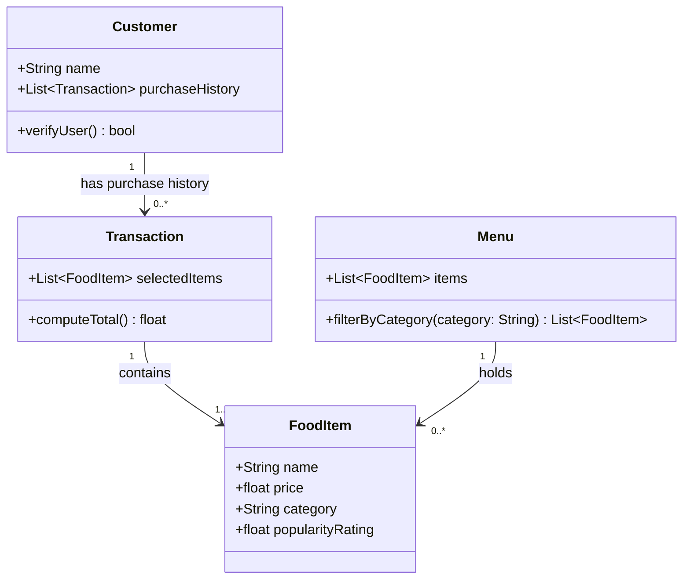

```mermaid
classDiagram
    class Customer {
        +String name
        +List~Transaction~ purchaseHistory
        +verifyUser() bool
    }

    class FoodItem {
        +String name
        +float price
        +String category
        +float popularityRating
    }

    class Menu {
        +List~FoodItem~ items
        +filterByCategory(category: String) List~FoodItem~
    }

    class Transaction {
        +List~FoodItem~ selectedItems
        +computeTotal() float
    }

    Customer "1" --> "0..*" Transaction : has purchase history
    Transaction "1" --> "1..*" FoodItem : contains
    Menu "1" --> "0..*" FoodItem : holds
```
